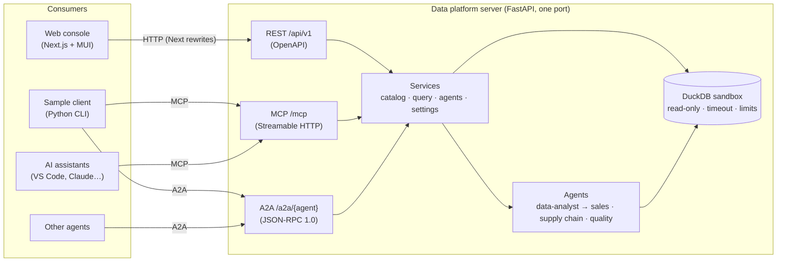

# Data platform mockup (MCP + A2A)

A self-contained **mock data platform**, in the spirit of Snowflake or Databricks. It serves realistic,
deterministic **manufacturing** and **retail** sample data and a team of **AI agents**. It exposes them through
three standard surfaces: REST, the [Model Context Protocol](https://modelcontextprotocol.io) (MCP) and the
[Agent2Agent protocol](https://a2a-protocol.org) (A2A).

Use it to prototype and demo AI applications (copilots, agents, assistants) against a believable data platform,
without cloud accounts, credentials or real data.

| Part | Folder | Stack |
| --- | --- | --- |
| Data platform server | [`server/`](server/README.md) | Python 3.12, FastAPI, DuckDB (in-memory), MCP Python SDK, A2A Python SDK |
| Web console | [`web/`](web/README.md) | Next.js (App Router), TypeScript, Material UI, MUI DataGrid, D3.js |
| Sample application | [`sample-client/`](sample-client/README.md) | Python 3.12, MCP client + A2A client |

## Architecture



All three surfaces share the same services, so a query or agent call behaves identically whichever protocol
carries it, and every call lands in the same query history.

## What is inside

### Sample data

The data is synthetic and generated at start-up from a fixed seed (`DATAPLATFORM_DATA_SEED`). It is consistent
across tables: orders reference real stores, products and customers, and sensor anomalies line up with
degraded machines. Tables use three-part names such as `retail.sales.orders`.

| Catalog | Schema | Tables (rows) |
| --- | --- | --- |
| `manufacturing` | `production` | plants (4), production_lines (14), machines (67), work_orders (5,000), quality_inspections (3,890), sensor_readings (22,512) |
| `manufacturing` | `supply_chain` | suppliers (25), materials (92), material_inventory (368), purchase_orders (2,500) |
| `retail` | `sales` | stores (18), products (240), customers (3,000), orders (15,000), order_items (35,697) |
| `retail` | `inventory` | store_inventory (4,320) |
| `retail` | `marketing` | campaigns (30) |

### AI agents

The agents are deterministic and rule-based (no LLM or API key needed, see [ADR-0002](docs/adr/0002-rule-based-agents.md)).
Each answer shows the SQL it ran, so users can inspect and reuse it.

| Agent | Role |
| --- | --- |
| `data-analyst` | Natural-language front door, like Databricks Genie or Snowflake Cortex Analyst. Explores the catalog and routes domain questions to a specialist. |
| `sales-insights` | Revenue trends, top products, store and channel performance, customer segments, category performance. |
| `supply-chain` | Material shortages, store low stock, supplier on-time performance, open purchase orders. |
| `quality-maintenance` | Defect rates, production yield, IoT sensor anomalies, maintenance due. |

### Protocol surfaces

| Surface | Endpoint | Highlights |
| --- | --- | --- |
| REST | `http://localhost:8000/api/v1` (docs at `/docs`) | Paginated, sortable, filterable, searchable collections; RFC 9457 problem details |
| MCP | `http://localhost:8000/mcp` | Tools `list_tables`, `describe_table`, `preview_table`, `run_sql`, `list_agents`, `ask_agent`; resources `dataplatform://catalog` and `dataplatform://tables/{catalog}/{schema}/{table}`; prompt `analyze-table` |
| A2A | `http://localhost:8000/a2a/{agentId}` | One agent card per agent at `/a2a/{agentId}/.well-known/agent-card.json`; a platform card at `/.well-known/agent-card.json` |

SQL is **read-only**: the engine rejects anything that is not a single `SELECT` statement (`WITH … SELECT`
included). It enforces a timeout, a row cap and memory/thread limits, and disables external file and network
access.

## Quick start

### Prerequisites

- Python 3.12 and [uv](https://docs.astral.sh/uv/)
- Node.js 24 LTS and npm
- Optional: Docker with Compose

> **Package feeds on Microsoft-managed devices.** Public PyPI is blocked on managed devices. Point uv at the
> Microsoft-protected feed before the first sync:
> `export UV_INDEX_URL=https://packagefeedproxy.microsoft.io/pypi/simple`
> (see `standards/development/package-feeds.md` in
> [ai-coding-standards](https://github.com/frkim/ai-coding-standards)). The committed `uv.lock` files were
> resolved against public PyPI because CI runners cannot reach the protected feed. If uv reports the lock as
> out of date on a managed device, run `uv lock` locally and don't commit the result.

### Run locally (three terminals)

```bash
# 1. Data platform server — http://localhost:8000 (OpenAPI at /docs)
cd server && uv sync && uv run dataplatform

# 2. Web console — http://localhost:3000
cd web && npm ci && npm run dev

# 3. Sample application — MCP + A2A operations briefing
cd sample-client && uv sync && uv run dataplatform-client briefing
```

### Run with Docker Compose

```bash
docker compose up --build        # server on :8000, web console on :3000
cd sample-client && uv run dataplatform-client briefing
```

The compose file binds both ports to `127.0.0.1` only, and runs the server with a read-only root file system.

### Connect an AI assistant over MCP

This repository ships [`.vscode/mcp.json`](.vscode/mcp.json). With the server running, open the folder in VS Code
and start the `dataplatform` server from the MCP view. Copilot chat in agent mode can then call the platform tools.
Other MCP hosts use the same Streamable HTTP URL: `http://localhost:8000/mcp`.

### Call an agent over A2A

```bash
curl -s localhost:8000/a2a/supply-chain/.well-known/agent-card.json | jq .name
cd sample-client && uv run dataplatform-client a2a quality-maintenance "Which machines are due for maintenance?"
```

## Testing

| Part | Command | Covers |
| --- | --- | --- |
| Server | `cd server && uv run ruff check . && uv run ruff format --check . && uv run mypy src tests && uv run pytest` | Engine sandbox, listing, agents, REST, MCP (in-process client), A2A (JSON-RPC); coverage gate 80 % |
| Sample client | `cd sample-client && uv run ruff check . && uv run ruff format --check . && uv run mypy src tests && uv run pytest` | End-to-end against a real server started on a free port |
| Web | `cd web && npm run lint && npm run format:check && npm run typecheck && npm test && npm run build` | API client, grid query/column mapping (dates, supported filter operators), formatting, theme toggle, Markdown rendering |

CI ([`.github/workflows/ci.yml`](.github/workflows/ci.yml)) runs all of the above plus the container image builds.
[CodeQL](.github/workflows/codeql.yml) scans Python, TypeScript and the workflows.

## Deploy

Every part ships a hardened container image: non-root user, multi-stage build, health check on the server.
The intended Azure target is **Azure Container Apps** on the Consumption plan, the smallest SKU that fits.
Images go to Azure Container Registry and are pulled with a managed identity. The Bicep templates and the
OIDC deployment workflow are follow-up work. The mockup has no authentication by design
([ADR-0004](docs/adr/0004-no-auth-local-mock.md)), so any shared deployment must sit behind Container Apps
authentication (Microsoft Entra ID).

## Repository layout

```text
server/          data platform: REST + MCP + A2A, DuckDB engine, agents, tests
web/             Next.js + MUI web console
sample-client/   Python sample application using MCP and A2A
docs/adr/        architecture decision records
.github/         CI, CodeQL, Dependabot, templates, CODEOWNERS
tmp/scripts/     throwaway scripts (git-ignored)
```

## Documentation

- [Architecture decision records](docs/adr/)
- [Contributing](CONTRIBUTING.md) · [Security policy](SECURITY.md) · [Agent instructions](AGENTS.md)

## Getting help

Open an [issue](https://github.com/frkim/dataplatform-mockup/issues). For security problems, follow
[SECURITY.md](SECURITY.md) instead.

## License

[MIT](LICENSE)
