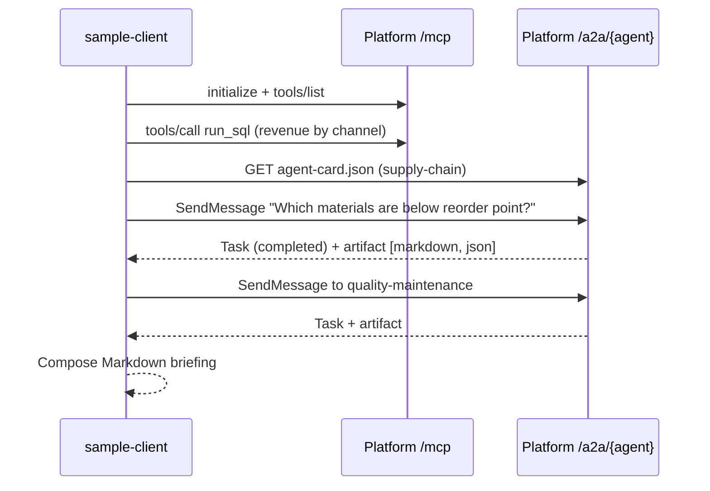

# Sample client — consuming the data platform over MCP and A2A

A small Python application that connects to the mock data platform the way a real AI application
would:

* **MCP** (Model Context Protocol, Streamable HTTP): discovers the platform tools, runs SQL and
  asks agents, as an AI assistant or IDE would.
* **A2A** (Agent2Agent protocol 1.0, JSON-RPC): resolves agent cards and delegates questions to
  the platform agents, as another agent would.

The `briefing` command combines both protocols into an **operations briefing**. It pulls KPIs over
MCP, asks the supply chain and quality agents over A2A, and prints one Markdown report.



## Run

Start the platform first (`cd ../server && uv run dataplatform`), then:

```bash
uv sync
uv run dataplatform-client tools                         # list MCP tools
uv run dataplatform-client sql "SELECT region, count(*) AS stores FROM retail.sales.stores GROUP BY region"
uv run dataplatform-client ask "Top 5 products in Electronics"          # MCP ask_agent tool
uv run dataplatform-client agents                        # list A2A agent cards
uv run dataplatform-client a2a supply-chain "Which suppliers are most often late?"
uv run dataplatform-client briefing                      # MCP + A2A combined report
```

Use `--base-url` (or `DATAPLATFORM_URL`) to target another deployment.

## Quality gates

```bash
uv run ruff check . && uv run ruff format --check .
uv run mypy src tests
uv run pytest     # starts an in-process platform server on a free port
```

The tests install the platform from `../server` as a dev dependency and run it with uvicorn on a
random local port. The client is exercised against the real MCP and A2A endpoints; nothing is
mocked.
